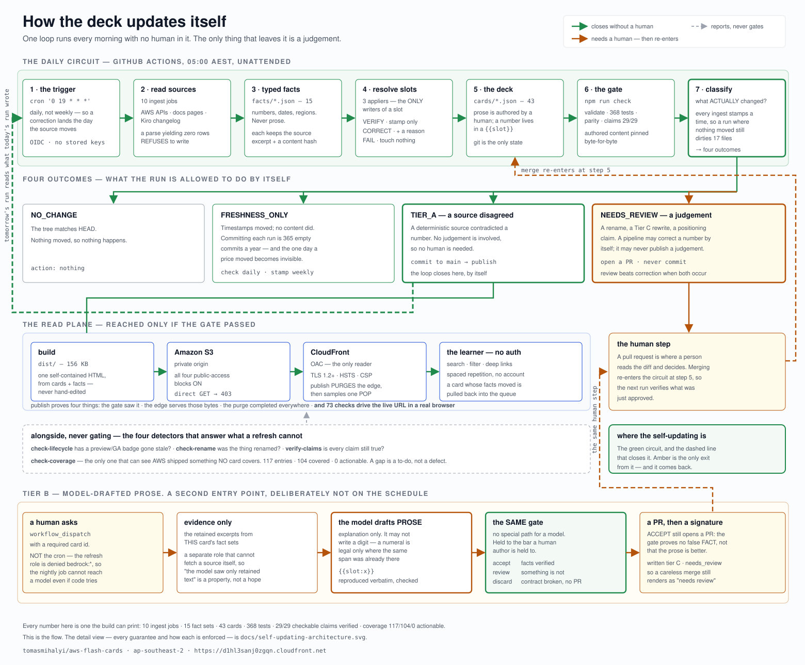

# AWS AI Flashcards

A flashcard deck that keeps its own factual claims current, and that shows a
learner the difference between a verified fact and an unverified judgement.

Domain: AWS AI, broadly — AgentCore, Bedrock and its full model catalogue,
SageMaker AI, coding agents (Kiro, Claude Code and Codex on Bedrock, Q
Developer), the Quick business-vs-engineer boundary, Strands/MCP/A2A, agentic
development practice, and AWS's perception/language/personalisation/forecasting
AI services as they earn a card.

> Renamed from "AgentCore Flashcards" once the deck outgrew AgentCore, and named to
> match the spec that defines it. Scope widened 2026-08-20 from AI-native
> development to AWS AI broadly (§4 of the project's requirements spec,
> development artifact, not published here) — depth still varies per service via
> `content/service-scope.json`, so "in scope" does not mean "tracked exhaustively".

**Status: live and self-maintaining.** The deck publishes from CI and refreshes
itself every morning at 05:00 AEST — [d1hl3sanj0zgqn.cloudfront.net](https://d1hl3sanj0zgqn.cloudfront.net).

**What this touches in AWS.** *Ingest* is read-only and stays that way: `src/lib/aws.ts`
carries an explicit six-pair `(service, operation)` allow-list, and the refresh IAM
role mirrors it with an explicit `Deny` on everything else. *Publish* does write — one
S3 object and a CloudFront invalidation, nothing more. *Tier B* invokes exactly one
inference profile. Three roles, each denied the other two's rights.

[](docs/update-loop.svg)

<sub>Click for full size. The detail view — every guarantee and how each one is
enforced — is [`docs/self-updating-architecture.svg`](docs/self-updating-architecture.svg).
Operating the refresh plane — OIDC setup, the variables, what to do when a run
fails — is [`.github/RUNBOOK.md`](.github/RUNBOOK.md).</sub>

## The one idea worth knowing

Facts are not prose.

```
facts/*.json                          cards/*.json
─────────────────────────             ────────────────────────
numbers, prices, dates,               explanation, framing,
region lists, API surfaces            "why it matters", memory hooks

written ONLY by deterministic         authored by a human, or by a model
ingest jobs                           under the Tier B/C gate
```

A card never stores a number that a deterministic source could supply. It stores
a **slot**, and a fact set fills it:

```jsonc
// cards/AC-19.json  (abridged)
"back": { "lead": "{{slot:region_availability}} GA brought the enterprise checklist: …" },
"slots": {
  "region_availability": {
    "tier": "A",
    "template": "AgentCore is available in {{fact:agentcore.regions.count}} AWS regions, including Asia Pacific (Sydney).",
    "rendered": "AgentCore is available in 19 AWS regions, including Asia Pacific (Sydney).",
    "rendered_from": "tier-a",
    "seed_text": "AgentCore previewed in four regions — including Asia Pacific (Sydney) — and has expanded steadily since."
  }
}
```

`seed_text` is what the deck used to claim, kept permanently. `rendered` is what
it claims now. The transition between them is a git commit with a provenance
record naming the source and its content hash.

This makes "numbers are never model-generated" an architectural property rather
than a policy someone has to remember to enforce.

## Layout

| Path | What it is |
|---|---|
| `cards/` | one JSON per card — **git is the source of truth** (43: AgentCore, Bedrock, Strands, coding agents, Quick) |
| `facts/` | deterministic fact sets — ingest writes these, nothing else does |
| `content/` | category taxonomy, pictogram library, the HTML shell and card template |
| `schema/` | published JSON Schema for cards and fact sets |
| `src/` | build, validate, parity gate, ingest jobs |
| `tools/` | one-time legacy migration, card-id ledger |
| `tests/fixtures/` | P1 parity baseline, committed API-surface snapshots |
| `dist/` | build output: `deck.json` + the single-file offline HTML |
| `agentcore-flashcards.html` | the original hand-authored deck, kept under its ORIGINAL name as the parity reference |

## Commands

Zero dependencies — TypeScript runs directly on Node ≥ 22.18's native type
stripping. There is no install step.

```bash
node src/validate.ts          # schema + lint + citation gate
node --test tests/*.test.ts   # 368 behavioural, guarantee, verifier, ingest, atom, coverage, rename, lint tests
node src/verify-claims.ts     # decompose every card into claims and verify each
node src/build.ts             # → dist/deck.json + dist/aws-ai-flashcards.html
node src/verify-parity.ts     # authored-content parity against the original deck
node src/check-lifecycle.ts   # has a preview/GA badge gone stale?
node src/check-rename.ts      # has the thing a card describes been renamed?
node src/check-coverage.ts    # what has AWS published that no card covers?

node src/ingest/ssm-regions.ts    # region availability  (read-only AWS)
node src/ingest/pricelist.ts      # pricing              (read-only AWS)
node src/ingest/service-quotas.ts # service LIMITS        (read-only AWS)
node src/ingest/botocore-diff.ts  # API surface          (local, no AWS)
node src/ingest/docs-release-notes.ts   # dated feature history, MONTH precision (public docs GET)
node src/ingest/docs-doc-history.ts     # dated change history, DAY precision  (public docs GET)
node src/ingest/docs-feature-regions.ts # per-FEATURE region availability      (public docs GET)
node src/ingest/docs-pages.ts           # service overview pages               (public docs GET)
node src/ingest/kiro-changelog.ts       # Kiro product news, DAY precision    (public Atom GET)
node src/ingest/github-releases.ts      # Strands release dating, NOT news    (public Atom GET)
node src/ingest/apply.ts          # resolve slots: verify, correct, or fail
node src/ingest/apply-rename.ts   # alias the old name, adopt the new one

node src/ingest/apply.ts --dry-run   # show the corrections without writing
```

`package.json` wraps these as npm scripts — `npm run check` runs the whole gate
(validate → test → build → parity), `npm run refresh` runs ingest → apply →
build. npm is only a task runner here; there are no packages to install.

## Guarantees, and how each one is enforced

| Guarantee | Enforcement |
|---|---|
| Numbers are never model-generated | Prose cannot hold a number a fact could supply; `validate` warns on every ungoverned numeric literal it finds |
| A past date needs a citation, not a slot | L-NUMERIC asks one question: will this number drift? A date already in the past cannot, so it is exempt from governance — and still checked by `verify-claims`, which is stricter about dates than this rule ever was. A *future* date, a price or a quantity is never exempt, and a bare current year is not either: "streaming (2026)" is imprecise prose, not settled history |
| A number is governed, not merely true | being correct today and re-rendering from a source tomorrow are different properties. A limit lives in a slot fed by the Service Quotas API, so the next refresh either confirms it or reports a correction |
| A rounded figure stays rounded | the Bedrock docs advertise "100+" models. The fact records that it is a FLOOR and the slot renders "over 100" — turning a lower bound into a count would be wrong in the direction that looks precise |
| A range is not its lower bound | "30–70%" needs both endpoints present with the unit; a scalar fact cannot answer a range |
| No claim without a citation | `validate` L-CITATION: a slot resolved from a source must carry `sources[]` + `verified_at` |
| Ingest cannot write to AWS | `src/lib/aws.ts` takes an explicit allow-list of `(service, operation)` pairs, not a `describe/list/get` heuristic |
| A missing fact never fakes freshness | `apply` leaves the card untouched and exits non-zero rather than stamping `verified_at` on an unverified claim |
| Card ids are never reused | append-only ledger in `content/card-id-ledger.json`; `validate` fails if an id disappears |
| Retirement never deletes | tombstones, `aka[]`, `superseded_by` — all modelled from P0 |
| A rename is an alias, never a replacement | `check-rename` matches rename phrasing in dated headings; `apply-rename` writes the old name into `aka[]` with its date and source, so search and shared links keep resolving |
| A rename needs two sources where a GA transition needs one | "is now generally available" has one meaning; a product NAME does not. A rename is applied only when a second, independent source uses the same name verbatim — otherwise it is reported and left alone |
| Authored content survived the migration | `verify-parity`: revert every slot to its `seed_text`, invert every recorded field correction, and the result must equal the original deck exactly |
| Nothing changes without a recorded reason | a correction to a card *field* (a stale `preview` badge) must carry a `before`/`after` provenance entry, or the parity gate fails |
| A stale lifecycle badge is caught | `check-lifecycle` matches card subjects against dated release-notes headings; `validate` warns on drift |
| The deck notices what it does NOT cover | every other gate keeps existing cards correct; `check-coverage` is the only one that can see AWS published something nobody wrote about. It ranks candidates by significance, distinguishes a missing card from a card that predates a change, and never fails a build — a gap is a to-do, not a defect |
| A source only speaks for its own product | Kiro's "CLI: Tangent Side-Conversations" matched AC-16 — the *AgentCore* CLI card — on the shared token `cli`, and `Code OSS` matched Code Interpreter. No threshold fixes that, because `cli` really is both cards' subject. Every dated entry carries the service it may speak for, and the check is exact, not statistical |
| "Not worth a card" stays distinguishable from "never looked" | `content/coverage-ignore.json` suppresses an entry only with a written reason, matched on the **exact** heading — so a reworded entry resurfaces instead of hiding under a stale rule |
| The UX contract still holds | `tests/deck-state.test.ts` — filter, navigate, flip, shuffle, clamping, progress, and the a11y invariant, against a state machine extracted out of the DOM |
| Exactly one card face is exposed to a screen reader | `aria-hidden` toggling asserted in the state machine, in the tests, and in a real browser |
| Every claim shown to a learner carries its source | provenance footer on the back face: verification date, source links, and an explicit "Unverified" marker with the reason when no source exists |
| A shared link survives a rename | the URL hash names a card *slug*, never an index, and resolves through `aka[]` aliases |
| A corrected card is re-studied, not left memorised wrong | spaced repetition stores a content hash per review; a card whose facts moved is pulled back into the queue whatever its interval says |
| A card that *builds on* a corrected card is resurfaced too | a review also records a fingerprint of the card's dependencies. When AC-04 is corrected, AC-18 — which quotes its pricing — is not wrong, but the ground under it moved, so it is queued as `context` with a banner naming the card that changed |
| The hidden card face is unreachable, not just unread | `aria-hidden` **and** `inert`, so a keyboard user cannot Tab onto the side they have not seen |
| A content hash means something | `validate` re-hashes each fact set's retained evidence; a tampered or mismatched provenance record fails the build |
| A number is verified, never judged | `verify-claims` string-matches every numeric, date and region claim against retained source text. Any failing claim demotes the whole card to Tier C |
| A match is about the claim, not merely near it | a fact may only answer a claim its own id does not contradict (Evaluations' count, never Runtime Instances'); a money claim needs a currency marker; a numeric claim needs a numeric fact; a date needs a topically related entry, ranked so the citation is the one a human would pick |

## Using the deck

| Action | How |
|---|---|
| Search | type in the box, or press `/` from anywhere. Tokens are ANDed and results ranked by where the match lands |
| Filter | open **Filters** for topics and tags (click an active tag again to clear); both compose with search |
| Navigate | `←` `→` or the buttons; `↑` `↓` flips |
| Share a card | copy the URL — it is `#/card/ac-19?cat=…&tag=…&q=…` and restores the whole view |
| Study | press `s` or **Start scheduled study**; flip, then grade with `1`–`4` (Again / Hard / Good / Easy). Progress lives in `localStorage`, no account; use Export, Import, or Reset to manage it |

A link that names a card wins over filters that would hide it, and an unknown
slug, tag or category degrades to the full deck rather than a blank page.

`dist/` is not committed (the parent vault's `.gitignore` excludes it) but is
fully regenerable from `cards/` + `facts/`. The P1 pre-ingest snapshot lives in
`tests/fixtures/p1-parity-baseline/`.

### Why the parity gate changed

Through P2 the gate compared the generated HTML byte-for-byte against the
original file — template, CSS, pictograms, 84 face renders, the whole shell. That
was the right check for proving the migration lost nothing, and it passed.

It also froze the markup. The deck shipped with a real accessibility defect (both
faces permanently in the DOM with no `aria-hidden`, so a screen reader read the
answer aloud while the question was showing), and every remaining frontend item
changes the DOM by definition. A gate that forbids all of them protects nothing
worth protecting.

So the guarantee moved rather than weakened: **behaviour** is pinned by tests,
**authored content** is still pinned byte-for-byte, and **deterministic
corrections** are reported rather than failed.

## What the deterministic sources cannot do

Release notes are organised by **month**. They can attest "AgentCore went GA in
October 2025"; they cannot attest "on October 13". A day-precision claim is
therefore reported `partial` — month and subject confirmed, day not — rather than
rounded up. The usual fix is to write the month the source can actually support,
and five cards have since been rewritten to do exactly that.

A **document history** page can see days, and one is now ingested. But a matching
date is not a citation: the Bedrock history has three entries dated July 16 2025
— Data Automation region expansion, Nova model import, custom model deployment —
and card AC-01 claims AgentCore previewed on Jul 16 2025. Verifying on the date
alone would have printed a data-automation note as the source for AgentCore's
preview. Relatedness is required as well, so that claim is still refused.

A contradiction is an accusation that the card is wrong, so it demands far
stronger evidence than a confirmation does. When the topical matcher simply fails
to find a related entry, the verdict is "cannot attest", never "the card is
lying" — the weak link there is the matcher, not the card.

### A recorded limit is a to-do, not a monument

`bedrock-agentcore` region data from SSM is *service*-level, so it could not
substantiate AC-12's *feature*-level claim that Evaluations is "GA in 9 regions".
That slot therefore stayed on its seed literal with the reason written onto the
card: *"Needs a Tier C source (What's New post or docs page) before this claim can
be verified."*

That source turned out to exist — `agentcore-regions.html` is a feature × region
matrix — and the slot is now Tier A. Evaluations is in **16** regions. The card
was not merely uncited, it was stale, and writing the limit down precisely rather
than filing it under "not verifiable" is what made it findable and closeable
later.

The matrix also disagrees with SSM about the total: 20 columns against 19
parameters. The difference is the AWS GovCloud (US-West) partition, which the
global-infrastructure path does not enumerate. Both numbers are correct about
different questions, so the ingest records the split instead of picking a winner.

### A rename is not a correction

AC-14 was titled "Agent Registry" while two AWS documentation surfaces had moved
to "AWS Agent Registry". Nothing in the repo could see it — `aka[]` had existed
since the first schema and nothing had ever written to it.

The ledger keeps `rename` and `correct` apart deliberately. A correction says the
card was **wrong**; a rename says the world changed its mind about what the thing
is **called**. Both are recorded reasons as far as the parity gate cares, but
collapsing them would destroy the only signal that tells those two apart when
reading a card's history later.

What a rename is not allowed to touch:

- **`lifecycle`.** The August entry reads "AWS Agent Registry launches under the
  new `agent-registry` namespace" — no GA language anywhere in it. Reading
  "launches" as "generally available" is exactly the overreach this repo exists
  to prevent, and April's "AgentCore Registry is now in Public Preview"
  independently confirms the card's `preview` state.
- **`service`.** That key joins a card to its deterministic sources. The same
  entry announces an `agent-registry` API namespace, but the pinned botocore
  snapshot still carries all twelve Registry control-plane operations under
  `bedrock-agentcore-control`, and does not yet have the
  `ListDiscoverableRegistryRecords` the entry announces. The namespace is recorded
  in the provenance reason; repointing the key on a claim the API surface cannot
  corroborate would orphan the card from every source that describes it.
- **prose.** Substituting the name in the lead is *nearly* mechanical, and
  "nearly" is doing real work: the new name contains the old one, so a naive
  replace is not idempotent and yields "AWS AWS Agent Registry" on a second run.
  Prose goes through a Tier C slot that retains `seed_text` and flags the card for
  sign-off.

### The limit that is permanent

No document settles a positioning judgement. The Quick-versus-Kiro boundary cards
carry no source, are Tier C by definition, and render as *Unsourced … needs
review* rather than borrowing credibility from a citation that cannot exist.

Quietly widening a source's authority to cover a claim it cannot support is the
exact failure this system exists to prevent.

## Next

**Shipped since this section was first written.** P3 read plane — S3 + CloudFront +
OAC in `ap-southeast-2`, published from CI on merge, and every publish now purges the
edge and drives the live URL through 73 browser checks. P4's Tier B — model-drafted
prose behind the string-matching verifier — is built and proven end to end: the model
cannot write a digit, and everything it produces arrives as a pull request. Automatic
rename detection with `aka[]` aliasing is live, as is the dependency fan-out.

**Open.** Content scale-up is the real gap: 43 cards against a 200–400 target, now a
review problem rather than an authoring one. Then the remaining P5 detectors — doc URL
redirects, Price List product disappearance, botocore rename-vs-remove — plus tracks
and the "what changed this week" deck.

**Unproven rather than unbuilt.** The failure watchdog has only ever run on days when
nothing failed, so whether it correctly opens a self-closing issue on a real failure is
still untested.

## On the contents of `facts/`

Every fact set retains an excerpt of the source it was read from. That is
deliberate and load-bearing — `verify-claims` string-matches each claim against
retained text, so a fact set with no evidence could not be checked at all.

Those excerpts are **verbatim third-party material**: AWS documentation, the Kiro
changelog, GitHub release notes. They are quoted here for verification, and they
remain the property of their respective owners. The card prose, the slot
templates and everything under `src/` are this repository's own.

No `LICENSE` file is present, which means default copyright. That is the
conservative position rather than an oversight: picking a permissive licence for
the repository as a whole would implicitly purport to license the retained
excerpts too, which is not this repository's to give.
